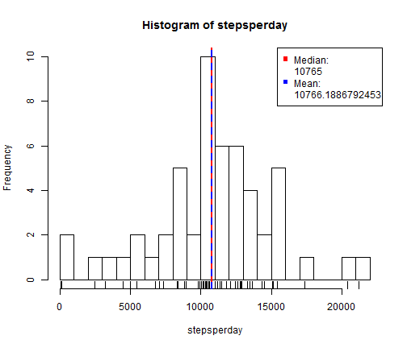
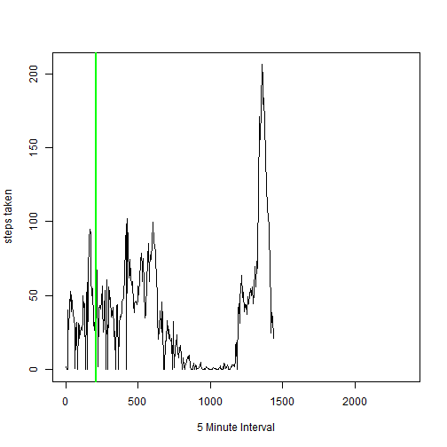

# Reproducible Research: Peer Assessment 1
Reproducible Research Project 1  Gene Beardslee
========================================================

This project is the first for this course and focuses on creating a Rmd file that processes some data from data sources that record personal movement activity.  

## Loading and preprocessing the data

First, the dataset needs to be read.


```r
setwd("~/GitHub/RepData_PeerAssessment1")
mvmnt <- read.csv("activity.csv", colClasses = c("integer", "Date", "factor"))
mins <- factor(seq(from = 0, to = 2355, by = 5), ordered = TRUE)
levels(mvmnt$interval) <- mins
```


```r
stepsperday <- tapply(mvmnt$steps, mvmnt$date, sum)
```

## What is mean total number of steps taken per day?


```r
hist(stepsperday, 30)
rug(stepsperday)
abline(v = median(stepsperday, na.rm = TRUE), col = "red", lwd = 2)
abline(v = mean(stepsperday, na.rm = TRUE), col = "blue", lwd = 2, lty = 2)
legend("topright", pch = c(15, NA_integer_, 15, NA_integer_), col = c("red", 
    "red", "blue", "blue"), legend = c("Median:", median(stepsperday, na.rm = TRUE), 
    "Mean:", mean(stepsperday, na.rm = TRUE)))
```

 

## What is the average daily activity pattern?

```r
stepsper5min <- tapply(mvmnt$steps, mvmnt$interval, mean, na.rm = TRUE)
sp5mdf <- data.frame(stepsper5min)
library(data.table)
sp5m <- data.table(sp5mdf, keep.rownames = TRUE)
```


```r
plot(sp5m$rn, sp5m$stepsper5min, type = "l", xlab = "5 Minute Interval", ylab = "steps taken")
lines(sp5m$rn, sp5m$stepsper5min)
abline(v = max(sp5m$stepsper5min, na.rm = TRUE), col = "green", lwd = 2)
```

 


## Imputing missing values

There were 2304 rows with missing values.


## Are there differences in activity patterns between weekdays and weekends?

